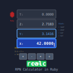

# RPN calculator for the command line

[](https://unlicense.org/)
[](https://github.com/isene/rcalc/stargazers)
[](https://isene.org)

This little function for the command line (specifically I am using zsh) opens
up a large array of mathematical functions by using
[raven](https://web.archive.org/web/20070828224224/http://mythago.net/language.html)
as the engine.


## Usage

Put "raven" into a bin directory in your path. Source "rcalc" in your shell's
rc file (like `.zshrc`): `source /path/to/rcalc`

Then you can calculate anything by simply starting with an equal sign and put
the calculations in quotes behind it. Remember, this is an
[rpn](ihttps://en.wikipedia.org/wiki/Reverse_Polish_notation) calculator using
postfix notation. Examples:

```
= "3 4 +"                         (yields 7)
= "30 tan 40 cos / 5 + 4 sqrt /"  (yields 7.302044)
= "3 asinh sqrt 3 pow exp10 log"  (yields 8.145936)
```

Now you don't need to put the calculation in quotes as long as you escape the
multiplication symbol '*' like this:

```
= 3 4 \*
```
Or by using the word "mul" instead:

```
= 3 4 mul
```


## Words

The words (operators) you can use in your calculations are:

```
+ - * mul / div */ muldiv /% divmod abs 
acos acosh asin asinh atan atan2 atanh 
cos cosh drop dup exp exp10 exp2 expm1 
int log log10 log1p log2 max mean median min mod
neg nip over pow round sin sinh sqrt tan tanh
```

There are plenty more [words in the raven programming
language](https://web.archive.org/web/20070828225150/http://mythago.net/manual.html)
(check that link for explanation of the above list of words), but the ones
listed here are the relevant words for this cli calculator.


## Background 

Raven is a fully fledged programming language packed into a binary that is
supplied as a binary with this project (check the archived raven page for the
source). It is a Forth-like language with features also from Python and Perl.
The syntax is simple and sane and it presents a wonderful way of tackling
complex problems by building "words" just like Forth does - but in a more
modern way. Raven was created by Sean Pringle and is a now a defunct project.
I am hoping to poke Sean to the point where he revives Raven.

Raven is licensed under GPL v2. The rest of this code snippet is public
domain.
